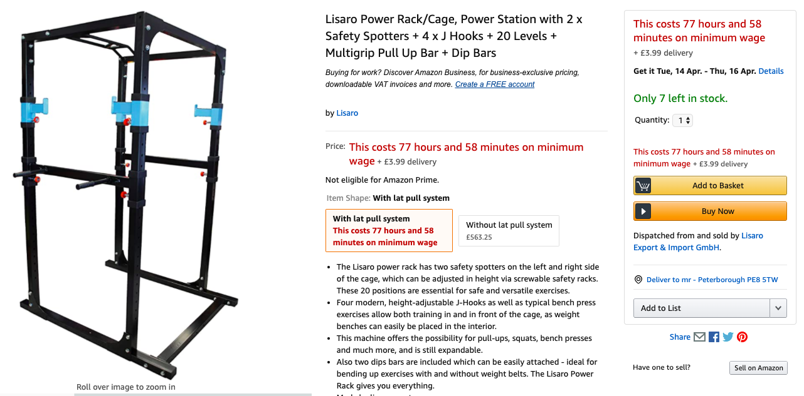
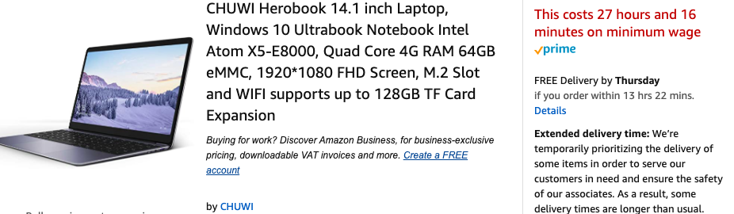

# WageIt

## Table of Contents

- [Description](#description)
- [Setup](#setup)
- [Examples](#example)
- [Contributing](#contributing)
- [License](#license)
- [Contact](#contact)

## Description

A simple chrome extension that converts prices to time worked on minimum wage

## Setup

Step 1: download the repo as a zip
Step 2: unzip download and save it somewhere memorable
Step 3: go to chrome://extensions
Step 4: enable developer mode
Step 5: select lode unpacked
Step 6: select the unzipped folder
Step 7: go to a product page on amazon.co.uk
Step 8: watch bugs appear

## Examples

## Contributing

PRs are very welcome
Follow the github flow!

1. FORK
2. MAKE CHANGES
3. TEST
4. PR

See [the contributing file](CONTRIBUTING.md)!

<!-- ALL-CONTRIBUTORS-BADGE:START - Do not remove or modify this section -->

<!-- ALL-CONTRIBUTORS-BADGE:END -->

## Contributors ✨

Thanks goes to these wonderful people ([emoji key](https://allcontributors.org/docs/en/emoji-key)):

<!-- ALL-CONTRIBUTORS-LIST:START - Do not remove or modify this section -->
<!-- prettier-ignore-start -->
<!-- markdownlint-disable -->
<table>
  <tr>
    <td align="center"><a href="https://github.com/AngeloGiacco"> <b>Angelo Giacco</b></a> <a href="https://github.com/AngeloGiacco/wageit/commits?author=AngeloGiacco" title="Code">💻</a></td>
  </tr>
</table>

<!-- markdownlint-enable -->
<!-- prettier-ignore-end -->
<!-- ALL-CONTRIBUTORS-LIST:END -->

This project follows the [all-contributors](https://github.com/all-contributors/all-contributors) specification. Contributions of any kind welcome!

## License

[MIT © Angelo Giacco.](LICENSE.md)

##Contact
get in touch
giacco.angelo.s at gmail dot com
